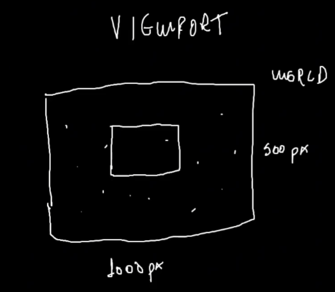
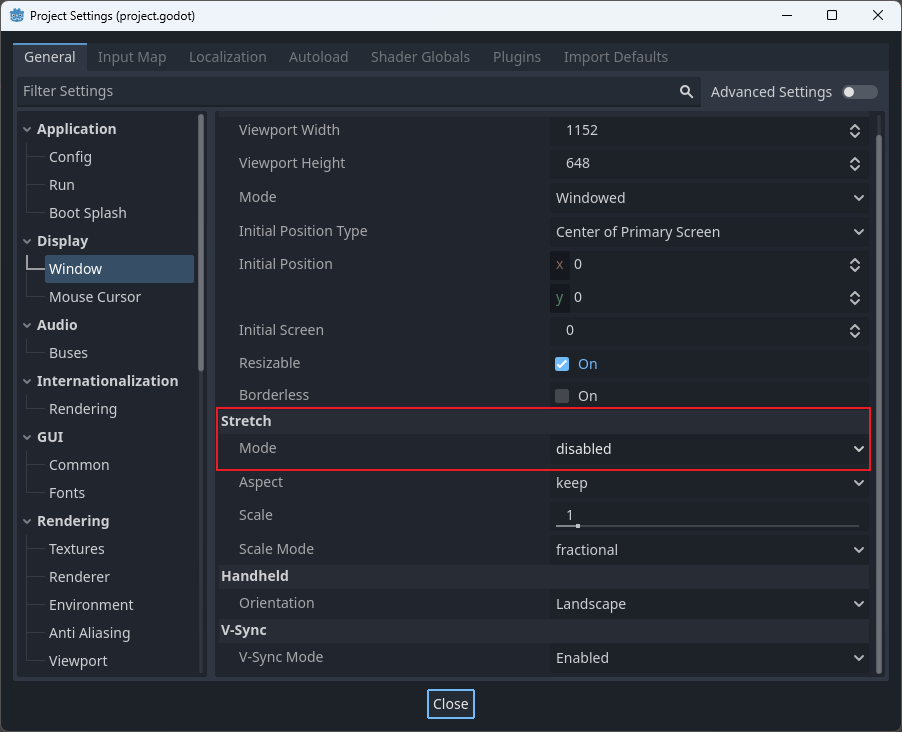
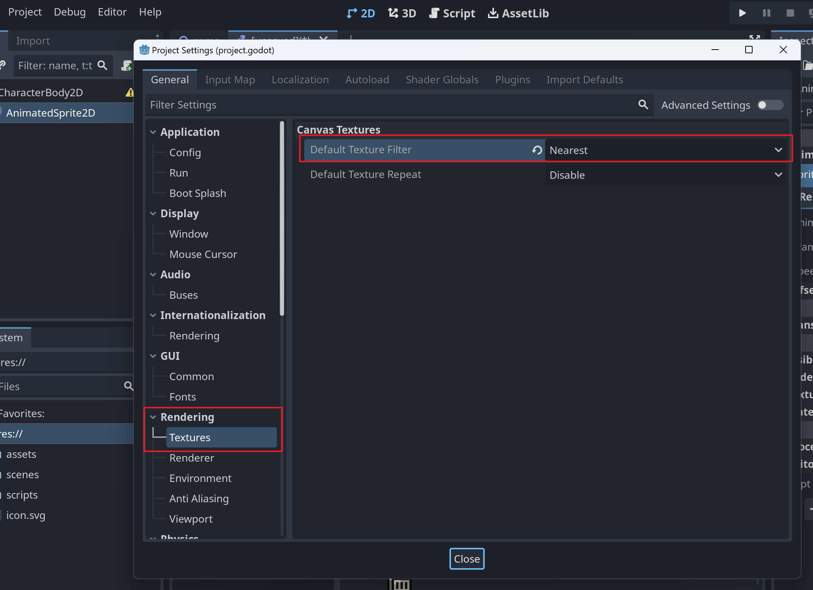
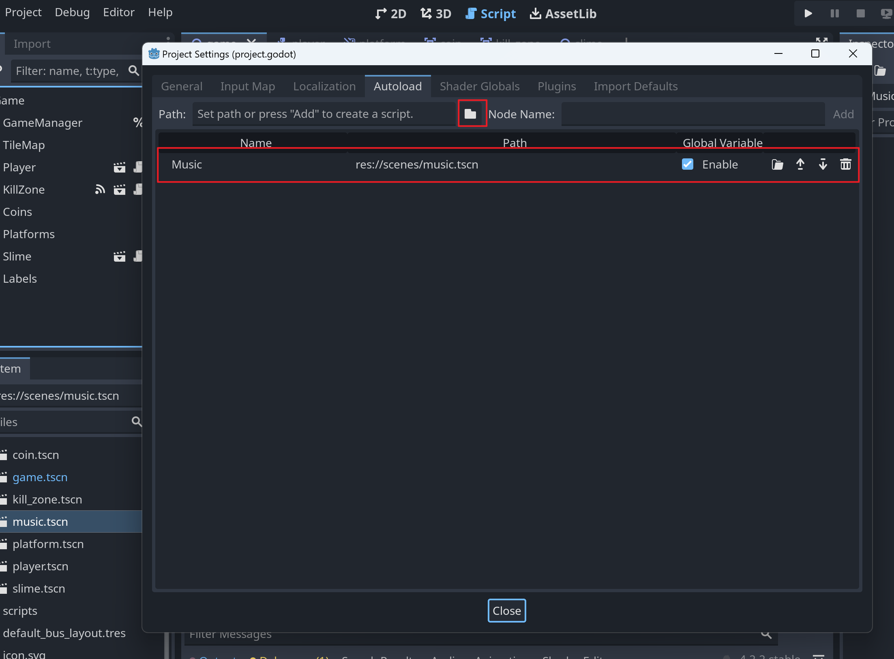

# Godot常见的概念
## viewport
  
Godot中viewport的概念：Viewport 在屏幕中创建不同的视图，或在另一个视口内创建子视图。就比如我们有8000*500像素的世界，viewport视口设置为320*180，那么我们只会显示这个视口的内容。

## Stretch Mode(拉伸模式)
  

# 2D像素的一些操作
## 调整渲染像素纹理的配置

配置好后会使像素从模糊变清晰。

## 自动加载音乐且不会因为重新加载游戏而中断

