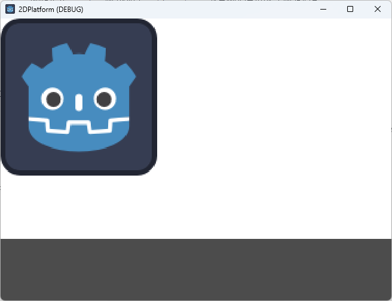

# Godot常见的概念
## viewport
  
Godot中viewport的概念：Viewport 在屏幕中创建不同的视图，或在另一个视口内创建子视图。就比如我们有8000 $\times$ 500像素的世界，viewport视口设置为320 $\times$ 180，那么我们只会显示这个视口的内容。

## Stretch Mode(拉伸模式)  
  

三种拉伸模式：
- disabled  
    
  假设我们的游戏视口为320 $\times$ 180像素，而游戏屏幕是640 $\times$ 360像素，拉伸模式设为disabled，那么游戏视口将会在游戏屏幕的左上角出现。
- canvas_items(2D游戏不建议使用)  
    
  与上面的情况相同，游戏视口是320 $\times$ 180像素，游戏屏幕是640 $\times$ 360像素，且有一个16 $\times$ 16的图片，但拉伸模式为canvas_items，那么它会获取视口并将其拉伸以填满整个屏幕，然后按照最终分辨率来缩放并渲染图片。所以16 $\times$ 16的图片将会以32 $\times$ 32的形式渲染出来。
  因为像素扩大了1倍，导致图片会变得更模糊。
  这对于3D没有影响，但是对于2D像素游戏，则可能会产生不好的影响。
- viewport(2D游戏推荐使用)  
    
  与canvas_items模式类似，区别在于godot会以320 $\times$ 180像素渲染游戏，等渲染完成后，它会获取结果并使用视口进行拉伸。就像先渲染一切，截取一张截图，然后拉伸这张截图。
  

## Stretch Aspect(拉伸方式)  
  

五种拉伸方式：  
- ignore  
    
  不关心游戏的宽高比，因此不会按比例缩放，导致非均匀拉伸。
- keep  
    
  假设我们有640 $\times$ 400的游戏屏幕，那么它会居中渲染，然后上下两边留有20像素的空白。
- keep_width  
    
  拉伸以匹配宽度，然后在屏幕上方渲染。
- keep_height  
    
  拉伸以匹配高度，然后在屏幕左侧渲染。
- expand  
  是keep_width与keep_height的结合体。会在上方或者左侧渲染，不会居中渲染。

  

# 2D像素的一些操作
## 调整渲染像素纹理的配置

配置好后会使像素从模糊变清晰。

## 自动加载音乐且不会因为重新加载游戏而中断

